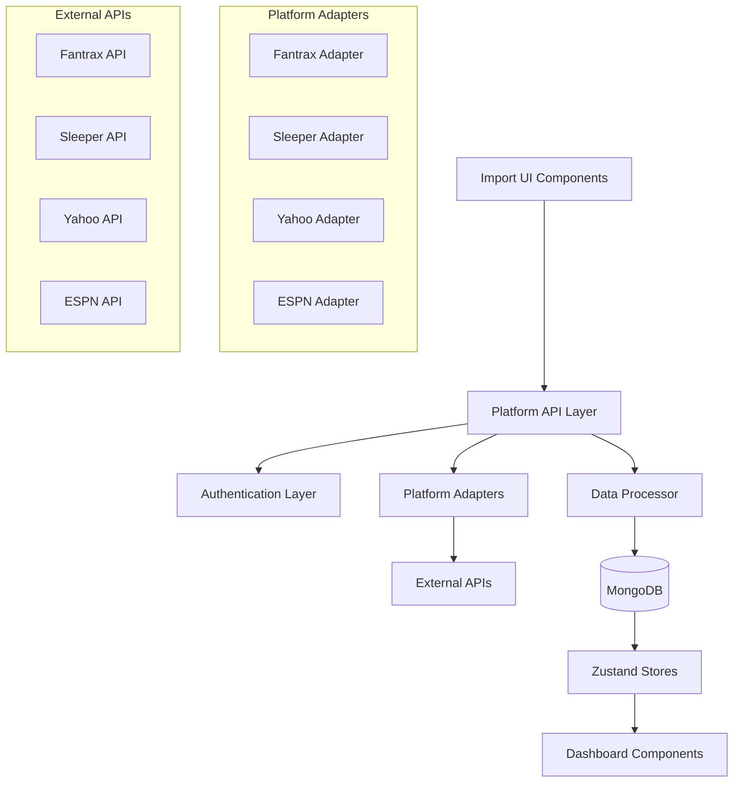

# Multi-Platform League Import - Design Document

## Overview

The Multi-Platform League Import feature will expand Playbook's current Fantrax-only integration to support Sleeper, Yahoo Fantasy Sports, and ESPN Fantasy Sports. This design builds upon the existing platform integration architecture while adding robust authentication flows, enhanced error handling, and a unified user experience across all platforms.

The system will maintain Playbook's sport-agnostic philosophy, ensuring that leagues from any platform can seamlessly integrate with existing analytics, trade tools, and dashboard features.

## Architecture

### High-Level Architecture



### Enhanced Platform Integration Architecture

The existing `PlatformIntegration` base class will be extended with enhanced authentication, error handling, and data validation capabilities:

```javascript
// Enhanced base class structure
class PlatformIntegration {
  constructor(platformId) {
    this.platformId = platformId;
    this.authHandler = new AuthenticationHandler(platformId);
    this.validator = new DataValidator(platformId);
    this.errorHandler = new ErrorHandler(platformId);
  }

  // Core methods (existing)
  async getUserLeagues(credentials) { /* ... */ }
  async getLeagueDetails(leagueId, credentials) { /* ... */ }
  
  // New enhanced methods
  async validateCredentials(credentials) { /* ... */ }
  async refreshAuthentication(credentials) { /* ... */ }
  normalizeLeagueData(rawData) { /* Enhanced normalization */ }
  handleRateLimit(error) { /* Rate limiting logic */ }
}
```

## Components and Interfaces

### 1. Authentication Layer

#### OAuth Flow Manager (`lib/auth/OAuthManager.js`)
Handles OAuth flows for Yahoo and future platforms requiring OAuth authentication.

```javascript
class OAuthManager {
  async initiateOAuth(platform, redirectUri) {
    // Generate OAuth URL with proper scopes
    // Store state parameter for security
    // Return authorization URL
  }

  async handleCallback(platform, code, state) {
    // Validate state parameter
    // Exchange code for access token
    // Store encrypted tokens
    // Return user credentials
  }

  async refreshToken(platform, refreshToken) {
    // Refresh expired access tokens
    // Update stored credentials
  }
}
```

#### Credential Manager (`lib/auth/CredentialManager.js`)
Secure storage and retrieval of platform credentials.

```javascript
class CredentialManager {
  async storeCredentials(userId, platform, credentials) {
    // Encrypt sensitive data
    // Store in MongoDB with expiration
  }

  async getCredentials(userId, platform) {
    // Retrieve and decrypt credentials
    // Check expiration and refresh if needed
  }

  async revokeCredentials(userId, platform) {
    // Securely delete stored credentials
    // Revoke tokens with platform if supported
  }
}
```

### 2. Enhanced Platform Adapters

#### Sleeper Integration Enhancement
Building on existing implementation with improved error handling and data validation:

```javascript
export class SleeperIntegration extends PlatformIntegration {
  constructor() {
    super('sleeper');
    this.baseUrl = 'https://api.sleeper.app/v1';
    this.rateLimit = new RateLimiter(1000, 60); // 1000 requests per minute
  }

  async validateCredentials(credentials) {
    try {
      const response = await this.rateLimit.execute(() =>
        axios.get(`${this.baseUrl}/user/${credentials.userId}`)
      );
      return { valid: true, user: response.data };
    } catch (error) {
      return { valid: false, error: this.errorHandler.normalize(error) };
    }
  }

  async getUserLeagues(userId, season) {
    // Enhanced with retry logic and better error handling
    const maxRetries = 3;
    let attempt = 0;
    
    while (attempt < maxRetries) {
      try {
        const response = await this.rateLimit.execute(() =>
          axios.get(`${this.baseUrl}/user/${userId}/leagues/nfl/${season}`)
        );
        
        return response.data.map(league => this.normalizeLeagueData(league));
      } catch (error) {
        if (this.shouldRetry(error) && attempt < maxRetries - 1) {
          attempt++;
          await this.delay(Math.pow(2, attempt) * 1000); // Exponential backoff
          continue;
        }
        throw this.errorHandler.normalize(error);
      }
    }
  }
}
```

#### Yahoo Integration Implementation
Complete OAuth-based integration for Yahoo Fantasy Sports:

```javascript
export class YahooIntegration extends PlatformIntegration {
  constructor() {
    super('yahoo');
    this.baseUrl = 'https://fantasysports.yahooapis.com/fantasy/v2';
    this.oauthManager = new OAuthManager('yahoo');
  }

  async initiateAuthentication(redirectUri) {
    return this.oauthManager.initiateOAuth('yahoo', redirectUri);
  }

  async handleAuthCallback(code, state) {
    const credentials = await this.oauthManager.handleCallback('yahoo', code, state);
    return credentials;
  }

  async getUserLeagues(accessToken, gameKeys = ['nfl', 'nba', 'mlb']) {
    const leagues = [];
    
    for (const gameKey of gameKeys) {
      try {
        const response = await axios.get(
          `${this.baseUrl}/users;use_login=1/games;game_keys=${gameKey}/leagues`,
          {
            headers: { 
              Authorization: `Bearer ${accessToken}`,
              Accept: 'application/json'
            }
          }
        );
        
        const gameLeagues = this.parseYahooResponse(response.data);
        leagues.push(...gameLeagues.map(league => this.normalizeLeagueData(league)));
      } catch (error) {
        // Log error but continue with other sports
        console.warn(`Failed to fetch ${gameKey} leagues:`, error.message);
      }
    }
    
    return leagues;
  }

  parseYahooResponse(data) {
    // Yahoo returns XML by default, JSON with proper Accept header
    // Handle both formats for robustness
    if (typeof data === 'string') {
      return this.parseYahooXML(data);
    }
    return this.parseYahooJSON(data);
  }
}
```

#### ESPN Integration Implementation
Cookie-based authentication for ESPN Fantasy Sports:

```javascript
export class ESPNIntegration extends PlatformIntegration {
  constructor() {
    super('espn');
    this.baseUrl = 'https://fantasy.espn.com/apis/v3/games';
  }

  async validateCredentials(credentials) {
    // Test credentials with a simple API call
    try {
      const response = await axios.get(
        `${this.baseUrl}/ffl/seasons/2024/segments/0/leagues/${credentials.testLeagueId}`,
        {
          headers: {
            Cookie: credentials.cookies
          },
          params: { view: 'mSettings' }
        }
      );
      return { valid: true };
    } catch (error) {
      return { valid: false, error: 'Invalid ESPN cookies or league access' };
    }
  }

  async getUserLeagues(cookies, year = 2024) {
    // ESPN doesn't have a direct "user leagues" endpoint
    // Users must provide league IDs manually
    throw new Error('ESPN requires manual league ID entry. Use getLeagueDetails with specific league ID.');
  }

  async getLeagueDetails(leagueId, seasonId = 2024, sport = 'ffl', cookies) {
    const sportPath = this.getSportPath(sport);
    
    try {
      const response = await axios.get(
        `${this.baseUrl}/${sportPath}/seasons/${seasonId}/segments/0/leagues/${leagueId}`,
        {
          headers: {
            Cookie: cookies
          },
          params: {
            view: ['mTeam', 'mRoster', 'mSettings', 'mStandings']
          }
        }
      );

      return this.normalizeLeagueData(response.data);
    } catch (error) {
      throw this.errorHandler.normalize(error);
    }
  }

  getSportPath(sport) {
    const sportMap = {
      'NFL': 'ffl',
      'NBA': 'fba', 
      'MLB': 'flb'
    };
    return sportMap[sport] || 'ffl';
  }
}
```

### 3. Import Flow Components

#### Platform Selection Component (`components/import/PlatformSelector.jsx`)
```jsx
const PlatformSelector = ({ onPlatformSelect }) => {
  const platforms = [
    { id: 'fantrax', name: 'Fantrax', authType: 'userSecret', sports: ['NBA', 'NFL', 'MLB'] },
    { id: 'sleeper', name: 'Sleeper', authType: 'userId', sports: ['NFL'] },
    { id: 'yahoo', name: 'Yahoo Fantasy', authType: 'oauth', sports: ['NBA', 'NFL', 'MLB'] },
    { id: 'espn', name: 'ESPN Fantasy', authType: 'cookies', sports: ['NBA', 'NFL', 'MLB'] }
  ];

  return (
    <div className="grid grid-cols-2 gap-4">
      {platforms.map(platform => (
        <PlatformCard 
          key={platform.id}
          platform={platform}
          onClick={() => onPlatformSelect(platform)}
        />
      ))}
    </div>
  );
};
```

#### Authentication Flow Component (`components/import/AuthenticationFlow.jsx`)
```jsx
const AuthenticationFlow = ({ platform, onAuthenticated }) => {
  const [authState, setAuthState] = useState('idle');
  
  const handleAuthentication = async (credentials) => {
    setAuthState('authenticating');
    
    try {
      const integration = createPlatformIntegration(platform.id);
      const validation = await integration.validateCredentials(credentials);
      
      if (validation.valid) {
        setAuthState('success');
        onAuthenticated(credentials);
      } else {
        setAuthState('error');
        setError(validation.error);
      }
    } catch (error) {
      setAuthState('error');
      setError(error.message);
    }
  };

  return (
    <div>
      {platform.authType === 'oauth' && (
        <OAuthFlow platform={platform} onAuthenticated={handleAuthentication} />
      )}
      {platform.authType === 'userSecret' && (
        <UserSecretForm platform={platform} onSubmit={handleAuthentication} />
      )}
      {platform.authType === 'userId' && (
        <UserIdForm platform={platform} onSubmit={handleAuthentication} />
      )}
      {platform.authType === 'cookies' && (
        <CookieForm platform={platform} onSubmit={handleAuthentication} />
      )}
    </div>
  );
};
```

#### League Selection Component (`components/import/LeagueSelector.jsx`)
```jsx
const LeagueSelector = ({ platform, credentials, onLeagueSelect }) => {
  const [leagues, setLeagues] = useState([]);
  const [loading, setLoading] = useState(true);
  
  useEffect(() => {
    const fetchLeagues = async () => {
      try {
        const integration = createPlatformIntegration(platform.id);
        const userLeagues = await integration.getUserLeagues(credentials);
        setLeagues(userLeagues);
      } catch (error) {
        setError(error.message);
      } finally {
        setLoading(false);
      }
    };
    
    fetchLeagues();
  }, [platform, credentials]);

  return (
    <div>
      {loading ? (
        <LoadingSpinner />
      ) : (
        <div className="space-y-4">
          {leagues.map(league => (
            <LeagueCard 
              key={league.id}
              league={league}
              platform={platform}
              onSelect={() => onLeagueSelect(league)}
            />
          ))}
        </div>
      )}
    </div>
  );
};
```

## Data Models

### Enhanced League Schema
```javascript
// MongoDB leagues collection - enhanced schema
{
  _id: ObjectId,
  
  // User and platform identification
  userId: String,
  platform: String, // 'fantrax', 'sleeper', 'yahoo', 'espn'
  platformLeagueId: String,
  
  // Basic league information
  leagueName: String,
  sport: String, // 'NBA', 'NFL', 'MLB'
  teamCount: Number,
  
  // League classification
  leagueType: String, // 'Redraft', 'Dynasty', 'Keeper'
  scoring: String, // 'Points', 'Categories'
  matchup: String, // 'H2H', 'Roto', 'Total Points'
  draftType: String, // 'Snake', 'Auction'
  
  // Platform-specific settings
  settings: {
    // Scoring configuration
    scoringSettings: Object,
    rosterPositions: Array,
    
    // League rules
    tradingEnabled: Boolean,
    waiverType: String,
    playoffWeekStart: Number,
    regularSeasonLength: Number,
    
    // Platform-specific data
    platformSpecific: Object
  },
  
  // Team and roster data
  teams: [{
    id: String,
    name: String,
    ownerId: String,
    ownerName: String,
    players: Array,
    standings: Object
  }],
  
  // Authentication and sync
  credentials: {
    encrypted: String, // Encrypted credential data
    expiresAt: Date,
    lastRefresh: Date
  },
  
  // Metadata
  createdAt: Date,
  updatedAt: Date,
  lastSyncAt: Date,
  syncEnabled: Boolean
}
```

### Platform Credentials Schema
```javascript
// MongoDB platformCredentials collection
{
  _id: ObjectId,
  userId: String,
  platform: String,
  
  // Encrypted credential data
  encryptedData: String,
  
  // Token management
  accessToken: String, // Encrypted
  refreshToken: String, // Encrypted
  expiresAt: Date,
  
  // Metadata
  createdAt: Date,
  lastUsed: Date,
  isActive: Boolean
}
```

## Error Handling

### Centralized Error Handler (`lib/errors/ErrorHandler.js`)
```javascript
class ErrorHandler {
  constructor(platformId) {
    this.platformId = platformId;
  }

  normalize(error) {
    // Convert platform-specific errors to standardized format
    const normalizedError = {
      code: this.getErrorCode(error),
      message: this.getUserFriendlyMessage(error),
      platform: this.platformId,
      retryable: this.isRetryable(error),
      originalError: error
    };

    return normalizedError;
  }

  getErrorCode(error) {
    // Map HTTP status codes and platform-specific errors to standard codes
    if (error.response?.status === 401) return 'AUTHENTICATION_FAILED';
    if (error.response?.status === 403) return 'ACCESS_DENIED';
    if (error.response?.status === 429) return 'RATE_LIMITED';
    if (error.response?.status >= 500) return 'SERVER_ERROR';
    if (error.code === 'ENOTFOUND') return 'NETWORK_ERROR';
    return 'UNKNOWN_ERROR';
  }

  getUserFriendlyMessage(error) {
    const code = this.getErrorCode(error);
    const messages = {
      'AUTHENTICATION_FAILED': 'Your credentials have expired. Please re-authenticate.',
      'ACCESS_DENIED': 'You don\'t have permission to access this league.',
      'RATE_LIMITED': 'Too many requests. Please wait a moment and try again.',
      'SERVER_ERROR': `${this.platformId} servers are experiencing issues. Please try again later.`,
      'NETWORK_ERROR': 'Network connection failed. Please check your internet connection.'
    };
    
    return messages[code] || 'An unexpected error occurred. Please try again.';
  }

  isRetryable(error) {
    const retryableCodes = ['RATE_LIMITED', 'SERVER_ERROR', 'NETWORK_ERROR'];
    return retryableCodes.includes(this.getErrorCode(error));
  }
}
```

## Testing Strategy

### Unit Testing
- **Platform Adapters**: Mock external API responses and test data normalization
- **Authentication Flows**: Test OAuth flows with mock tokens and credentials
- **Error Handling**: Test error scenarios and user-friendly message generation
- **Data Validation**: Test league data validation and sanitization

### Integration Testing
- **API Endpoints**: Test complete import flows with test accounts
- **Database Operations**: Test league storage and retrieval with various data formats
- **Authentication**: Test OAuth flows with sandbox environments where available

### End-to-End Testing
- **Complete Import Flows**: Test full user journey from platform selection to league import
- **Cross-Platform Compatibility**: Ensure consistent behavior across all platforms
- **Error Recovery**: Test error scenarios and recovery mechanisms

## Security Considerations

### Credential Security
- **Encryption**: All sensitive credentials encrypted using AES-256
- **Token Storage**: OAuth tokens stored with expiration and automatic refresh
- **Access Control**: User-specific credential isolation with proper authorization checks

### API Security
- **Rate Limiting**: Implement per-platform rate limiting to prevent API abuse
- **Request Validation**: Validate all incoming requests and sanitize data
- **HTTPS Only**: All external API communications over HTTPS

### Data Privacy
- **Minimal Data Storage**: Store only necessary league data, not personal information
- **Data Retention**: Implement data retention policies for inactive leagues
- **User Consent**: Clear consent flows for data access and storage

## Performance Optimizations

### Caching Strategy
- **League Data**: Cache league information with configurable TTL
- **Player Mappings**: Cache player ID mappings across platforms
- **API Responses**: Cache frequently accessed data to reduce API calls

### Async Processing
- **Background Sync**: Implement background league synchronization
- **Batch Operations**: Process multiple leagues in batches for efficiency
- **Queue Management**: Use job queues for long-running import operations

### Database Optimization
- **Indexing**: Proper indexing on userId, platform, and platformLeagueId
- **Connection Pooling**: Efficient MongoDB connection management
- **Query Optimization**: Optimize queries for league retrieval and updates

## Monitoring and Analytics

### Import Metrics
- **Success Rates**: Track import success rates per platform
- **Error Frequency**: Monitor common error patterns and frequencies
- **Performance Metrics**: Track import times and API response times

### User Analytics
- **Platform Usage**: Track which platforms are most popular
- **Feature Adoption**: Monitor usage of imported league features
- **User Retention**: Track user engagement with imported leagues

This comprehensive design provides a robust foundation for implementing multi-platform league import while maintaining security, performance, and user experience standards.